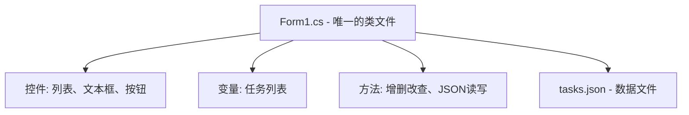

# 设计文档：待办事项应用

## 概述

一个简单的 Windows Forms 待办事项应用，使用 C# 编写。**所有代码都在一个窗体类中**，使用 JSON 文件保存数据。适合大一学生学习，代码简洁易懂。

## 架构



**极简架构**：只有一个 `Form1.cs` 文件，包含所有代码。

## 组件设计

### 唯一组件：Form1

```csharp
public partial class Form1 : Form
{
    // ===== 成员变量 =====
    private List<TaskItem> tasks = new List<TaskItem>();  // 任务列表
    private string jsonPath = "tasks.json";                // JSON文件路径
    
    // ===== 内部类（简单结构） =====
    private class TaskItem
    {
        public string Content { get; set; }      // 任务内容
        public bool IsCompleted { get; set; }    // 是否完成
    }
    
    // ===== 按钮事件 =====
    private void btnAdd_Click(object sender, EventArgs e);     // 添加任务
    private void btnDelete_Click(object sender, EventArgs e);  // 删除任务
    private void listBox_ItemCheck(object sender, EventArgs e); // 勾选完成
    
    // ===== 辅助方法 =====
    private void LoadTasks();      // 从JSON加载
    private void SaveTasks();      // 保存到JSON
    private void RefreshList();    // 刷新显示
    private void UpdateStats();    // 更新统计
}
```

### 界面布局

```
+------------------------------------------+
|  待办事项                       [_][□][X] |
+------------------------------------------+
|  [输入框 txtTask          ] [添加]       |
+------------------------------------------+
|  ☑ 买菜                        [删除]    |
|  ☐ 写作业                      [删除]    |
|  ☑ 看书                        [删除]    |
|  ☐ 运动                        [删除]    |
+------------------------------------------+
|  总计: 4 项  |  已完成: 2 项             |
+------------------------------------------+
```

## 数据模型

**使用简单的内部类**，不需要单独的文件：

```csharp
// 在 Form1 类内部定义
private class TaskItem
{
    public string Content { get; set; }      // 任务内容
    public bool IsCompleted { get; set; }    // 是否完成
}
```

**JSON 文件格式**：

```json
[
    {"Content": "买菜", "IsCompleted": true},
    {"Content": "写作业", "IsCompleted": false}
]
```

## 正确性属性

*正确性属性是系统在所有有效执行中都应保持为真的特征或行为。*

### 属性 1：添加任务增加计数

对于任何非空任务内容，添加后任务列表数量应恰好增加 1。

**验证需求：1.1**

### 属性 2：空任务被拒绝

对于任何空字符串或纯空白字符串，应用应拒绝添加，列表保持不变。

**验证需求：1.2**

### 属性 3：完成状态切换

对于任何任务，切换完成状态两次应返回原始状态。

**验证需求：2.1**

### 属性 4：JSON 往返一致性

对于任何任务列表，保存到 JSON 后再加载应返回完全相同的任务列表。

**验证需求：4.1, 4.2**

### 属性 5：统计准确性

对于任何任务列表，显示的总数应等于列表长度，已完成数应等于已完成任务的数量。

**验证需求：5.1, 5.2**

## 错误处理

简单的错误处理：

```csharp
// 空任务检查
if (string.IsNullOrWhiteSpace(txtTask.Text))
{
    MessageBox.Show("请输入任务内容");
    return;
}

// JSON文件不存在时
if (!File.Exists(jsonPath))
{
    tasks = new List<TaskItem>();  // 使用空列表
}
```

## 测试策略

**本项目不需要单独的测试文件**，代码简单到可以直接运行验证。

学生可以通过手动测试验证：
- 添加任务、删除任务
- 勾选完成、取消完成
- 关闭程序后重新打开，检查数据是否保存
